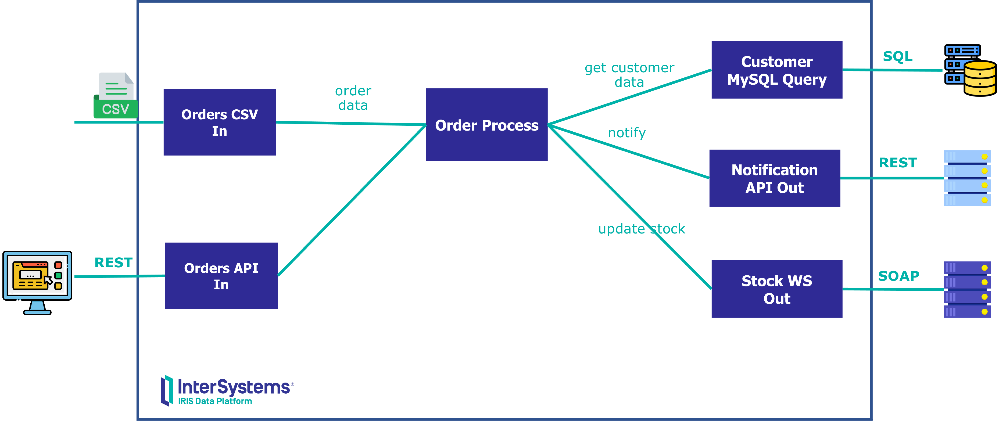
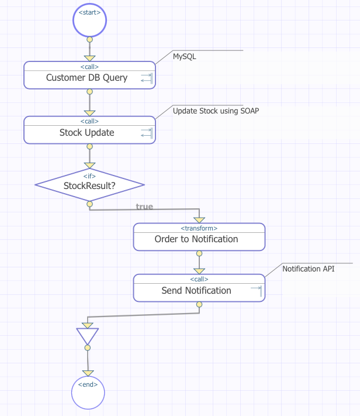

# 🚀 Workshop: Introduction to InterSystems IRIS Interoperability

[](./LICENSE) [](https://www.docker.com/) [](https://code.visualstudio.com/) [](#) [](https://www.intersystems.com/iris)

Welcome! This repository contains a set of hands-on examples to help you understand the key concepts of the **InterSystems IRIS Interoperability Framework**.

> For more in-depth learning resources, visit [InterSystems Learning](https://learning.intersystems.com).

> If you are interested in 🏥 HealthCare interoperability, visit [workshop-healthcare-interop](https://github.com/intersystems-ib/workshop-healthcare-interop)

---

## 🧰 Requirements

To run this workshop, please make sure you have the following installed:

- [Git](https://git-scm.com/downloads)  
- [Docker](https://www.docker.com/products/docker-desktop) and [Docker Compose](https://docs.docker.com/compose/install/) - ⚠️ On Windows, ensure Docker is set to use **Linux containers**.  
- [Visual Studio Code](https://code.visualstudio.com/download) with [InterSystems ObjectScript Extension Pack](https://marketplace.visualstudio.com/items?itemName=intersystems-community.objectscript-pack)

---

## ⚙️ Setup

Clone the repository and start the project using Docker Compose:

```bash
git clone https://github.com/intersystems-ib/workshop-interop-intro
cd workshop-interop-intro
docker compose build
docker compose up -d
```

Then, open the `workshop-interop-intro` folder in **VS Code**.

---

## 📂 Examples

### 1. 💰 Loan Request Flow: Talk to Multiple Banks

In this scenario, the system receives a loan request and queries multiple banks to determine loan approval, then aggregates the responses.

#### 🔍 Steps:

1. Open the [Management Portal](http://localhost:52773/csp/sys/UtilHome.csp)
2. Login with:  
   - **Username:** `superuser`  
   - **Password:** `SYS`  
3. Navigate to:  
   **Interoperability > Namespace: `INTEROP` > List > Productions > `Demo.Loan.FindRateProduction` > Open**
4. Click **Start Production**
5. Explore the **Business Services**, **Processes**, and **Operations**
6. Use the green connector icons to inspect component interactions
7. Use the *Legend* to understand the meaning of component colors

#### 🧪 Test a Business Operation

- Click `Demo.Loan.WebOperations`
- Go to **Actions > Test**
- Choose `Demo.Loan.CreditRatingRequest` and provide some sample input
- Review the result in the **Visual Trace**
- Investigate the related classes and messages in **VS Code**

#### 🧾 Submit a Sample Loan Request

1. Open the [Loan Form Page](http://localhost:52773/csp/interop/DemoLoanForm.csp)
2. Submit a request with test data
3. View results in the [Message Viewer](http://localhost:52773/csp/interop/EnsPortal.MessageViewer.zen)
4. Review messages, traces, and how the system handled sync/async messaging and errors

#### 🔧 Inspect the Business Process

- Open `Demo.Loan.FindRateDecisionProcessBPL` from the production config
- In the **Settings** tab, click the magnifier icon next to the *Class Name*
- Explore the graphical **BPL (Business Process Language)** definition
- When finished, **stop the production**

---

### 2. 📦 Handling Orders with DB Lookup & Web Service Call

This example processes incoming orders, enriches them with customer info from a MySQL database, and sends data to web services.



#### 🗃️ Check the External Database

A MySQL database is already running in your Docker environment.

Run the following to inspect it:

```bash
docker exec -it mysql bash
mysql --host=localhost --user=testuser testdb -p  # Password: testpassword
```

Query example:

```sql
select * from customer;
```

> 🧠 You'll find sample customer data preloaded for testing.

#### ▶️ Start the Order Production

1. Navigate to:  
   **Interoperability > Namespace: `INTEROP` > List > Productions > `Demo.Order.Production` > Open**
2. Click **Start Production**

#### 📁 Process a Sample CSV File

1. In VS Code, copy files from `test/*.csv` into the `test/in/` folder
2. Watch the messages flow in the [Message Viewer](http://localhost:52773/csp/user/EnsPortal.MessageViewer.zen)

#### 🌐 Add a SOAP Web Service to Update Stock

Use the provided WSDL file to generate a web client:

1. In VS Code, open the **SOAP Wizard**
2. Use the following options:
   - **WSDL File:** `/install/StockSoapService.wdsl`
   - **Proxy Class Package:** `Demo.Order.WSC.Stock`
   - ✅ *Check "Create Business Operation"*
   - **Operation Class Package:** `Demo.Order.WSC.Stock.BO`
   - **Request/Response Package:** `Demo.Order.WSC.Stock.Msg`

Then:

3. In the production:
   - Add a new **Business Operation**
   - Set class to: `Demo.Order.WSC.Stock.BO.StockSoapServiceSoap`
   - Name it: `StockSoap WS Out`
4. Under Settings:
   - Add **SOAP Credentials**: `StockWS_User`
   - ✅ *Check "Enabled"*
5. Use **Actions > Test** to verify connectivity

#### 🔁 Update the Order Process to Use the Web Service

Now edit the Order Business Process to call the new SOAP operation.

```text
Edit the BPL to include a new step calling `StockSoap WS Out`
```

You can use the following image as a guide:




#### 🌐 Add a REST Order API

Now, you will add a new API to receive orders via REST.

1. In the production, add a new **Business Service**:
   - **Service Class**: `Demo.Order.BS.OrderAPI`
   - **Service Name**: `Order API In`
   - ✅ Check "Enable now"

2. Test the service using the included [Postman collection](./workshop-interop-intro.postman_collection.json)  
   **or** use `curl` from your terminal:

```bash
curl -X POST http://localhost:52773/order/api/order \
  -H "Content-Type: application/json" \
  -d '{
    "OrderPriority": "Not Specified",
    "Discount": "0",
    "UnitPrice": "205.99",
    "ShippingCost": "2.5",
    "CustomerID": "3",
    "ShipMode": "Express Air",
    "ProductCategory": "Technology",
    "ProductSubCategory": "Telephones and Communication",
    "ProductContainer": "Small Box",
    "ProductName": "V70",
    "OrderDate": "7/27/2011",
    "Quantity": "8",
    "Sales": "1446.67",
    "OrderID": "88523"
}'
```

> 💡 Check the [Message Viewer](http://localhost:52773/csp/user/EnsPortal.MessageViewer.zen) to see how the new REST request flows through the production.

3. After successfully testing the service using `curl`, try this [sample web app](http://localhost:8080).  
   It's a **simple Angular frontend** designed to illustrate how a web application can interact with **IRIS APIs**.

---

## 🧑‍🏫 Want to Learn More?

Check out the official [InterSystems Learning Portal](https://learning.intersystems.com) for more courses, videos, and certifications on interoperability and beyond.
